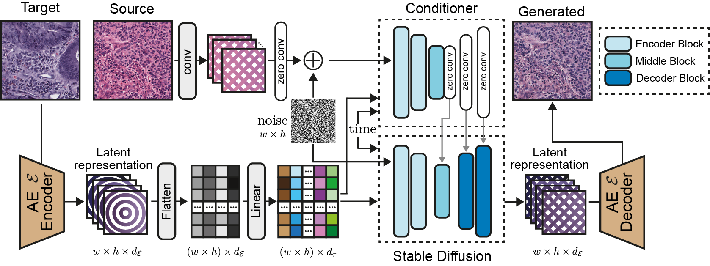

# StainFuser: Controlling Diffusion for Faster Neural Style Transfer in Multi-Gigapixel Histology Images

A conditional diffusion model for high quality stain normalisation. The network transforms a source image to have the staining characteritics of an input target image via a controlled diffusion process.

<p align="center">
   📃 <a href="https://arxiv.org/abs/2403.09302" target="_blank">Paper</a> • 🤗 <a href="https://huggingface.co/R-J/StainFuser" target="_blank">Model Weights</a> • 🤗 <a href="https://huggingface.co/datasets/R-J/SPI-2M" target="_blank">Data</a> 
</p>





## Updates

* **[15.03.2024]** [Paper](https://arxiv.org/abs/2403.09302) released.

## Environment
```
bash make_env.sh
```
We also provide a Dockerfile which will replicate the enivronment we used in development.

## Repository Structure
Directories in the repository:
- `conf`: configuration files used by hydra during training pipeline for experiment tracking
- `docs`: figures used in the repo
- `src`: main directory
    - `configs`: directory of model component configuration files
    - `misc`: helper functions
        - `model_utils`: model utility functions
        - `utils`: general helper functions
    - `models`: model definitions
        - `arch`: general architectures
        - `wsi`: wsi level class
    - `dataset`: dataset classes
    - `logger`: custom logger for debugging during training
    - `recipe`: pytorch lightning module for training and inference

Executable scripts:
- `train.py`: main training script
- `run_patch.py`: inference script for patch/tile level processing
- `run_wsi.py`: WSI inference code

# Running the code

## Inference
### WSI level
<!-- <details><summary>Click to expand</summary> -->
- Input:
    - WSIs supported by [TiaToolbox](https://github.com/TissueImageAnalytics/tiatoolbox/) e.g. `svs`, `tif`, `ndpi`, `jp2`, `tiff` etc.
- Output:
    - `tif` stain normalized version of each WSI

Usage:
```
python run_wsi.py [options]
```

Options:
```
    --batch_size=<n>        Batch size. [default: 8].
    --ckpt_path=<path>      Path to stainFuser weights.
    --config_path=<path>    Path to model component configs.
    --target_path=<path>    Path to target image.
    --output_dir=<path>     Path to output directory where normalized images are saved to.
    --wsi_dir=<path>        Path to directory containing wsis.
    --msk_dir=<path>        Path to directory containing tissue masks per slide.
    --cache_dir=<path>      Path to directory for caching results.
    --log_path=<path>       Path to directory for outputing logs.
    --file_list=<path>      Optional path to list of file stems to only process a subset of files.
    --diffusion_step=<n>    Number of denoising steps. [default: 20].
    --num_workers=<n>       Number of workers for multiprocessing. [default: 8]
    --fp16=<bool>           Whether to use mixed precision for speedup.
```

Notes:
- masks must have the same name as given slide e.g. for `slide0.svs` mask must be named `slide0.png`
- GPU requirements. Using a batch size of 8 requires ~18 GB GPU RAM for 512x512 images with fp16 precision, with a batch size of 32 ~50GB GPU RAM is needed with the same settings. The image size is the main factor in the amount of GPU memory used. The default config in the WSI processing engine uses 512x512 tiles at 0.5MPP as StainFuser performs better with larger images.

<!-- </details> -->
### Tile level

Input:
- Standard image files, `png`, `jpg`, `tiff` etc.
- Numpy array, `N x M x M x 3` numpy arrays of saved images in uint8 format.

Output:
- Either:
    - a `npy` file in order of either file name or npy array order
    - folder of specified format images with same names as original files or indexed from 0 if npy input

Usage:
```
run_patch.py [options] [--help] <command> [<args>...]
```

Options:
```
    --batch_size=<n>        Batch size. [default: 8].
    --ckpt_path=<path>      Path to stainFuser weights.
    --config_path=<path>    Path to model component configs.
    --source_path=<path>    Path to source data or directory.
    --target_path=<path>    Path to target image.
    --output_dir=<path>     Path to output directory where normalized images are saved to.
    --diffusion_steps=<n>   Number of denoising steps. [default: 20].
    --num_workers=<n>       Number of workers for multiprocessing. [default: 8]
    --save_fmt=<str>        Format to save output in, choices [npy, png]
    --fp16=<bool>           Whether to use mixed precision for speedup.
```

## Training
For training, download the data from [here](https://huggingface.co/datasets/R-J/SPI-2M).

Usage:
```
python train.py --config-name "train"
```

### Notes
- Configs
    - We use [hydra](https://hydra.cc/docs/intro/) to control the training configs in this repo.
    - For more information on this please see the hydra documentation.
    - Paths to data, model checkpoints and output directories will need to be set beforehand in `conf/paths/default.yaml` and `conf/experiment/*exp_name.yaml`/.

- Sulis use
    - We used a Sulis cluster as part of our experiments and provide some additional configs and example training code in `conf/train_slurm.yaml` as well as `train.py`.
    - If you wish to use this you will need to set up slurm submission scripts with the paramters of your cluster.

### Illustrative Example of model training
<p align="center">
  
</p>

## Future work
- Explore quantisation of model weights to reduce inference cost.
- Expand dataset with increased diversity of organs/tissue types, centers and staining types.

## Authors

* [Robert Jewsbury](https://github.com/R-J96)
* [Ruoyu Wang](https://github.com/ruoyussh)
* [Quoc Dang Vu](https://github.com/vqdang)

## Citation

If you use any part of this code, please cite our paper.

BibTex entry:
```
@misc{jewsbury2024stainfuser,
      title={StainFuser: Controlling Diffusion for Faster Neural Style Transfer in Multi-Gigapixel Histology Images}, 
      author={Robert Jewsbury and Ruoyu Wang and Abhir Bhalerao and Nasir Rajpoot and Quoc Dang Vu},
      year={2024},
      eprint={2403.09302},
      archivePrefix={arXiv},
      primaryClass={eess.IV}
}
```